# The Eight Admissible Residue Lanes of Modulo 30

## Rolling Spectral, Graph, and Sparse Dynamics over ℤ/30ℤ

---

## Abstract

This paper studies rolling dynamical structure over the eight admissible residue classes modulo 30:

\[
R = \{1,7,11,13,17,19,23,29\}
\]

Using rolling-window residue occupancy vectors, we analyze temporal drift, boundary imbalance, spectral decomposition, graph embeddings, and sparse reset-boundary emergence across prime-support trajectories over ℤ/30ℤ.

The resulting system exhibits coherent low-rank structure, bounded spectral drift, graph-topological organization, and sparse transition behavior concentrated near modulo-reset boundaries.

This work introduces a computational experimental mathematics framework for residue-manifold analysis using rolling spectral, graph, and sparse dynamical methods.

---

# 1. Introduction

Modulo-30 wheel factorization partitions integers into residue classes over:

\[
\mathbb{Z}/30\mathbb{Z}
\]

The admissible residue classes coprime to 30 are:

\[
R = \{1,7,11,13,17,19,23,29\}
\]

These eight residue classes contain all prime numbers greater than 5.

Traditional wheel-factorization methods treat these classes statically. Here we instead study rolling-window dynamical structure across the admissible residue lanes.

The central question becomes:

> do admissible residue trajectories exhibit coherent rolling manifold structure?

We construct rolling occupancy vectors, boundary-pressure metrics, spectral decompositions, graph embeddings, and sparse reset-boundary analyses over rolling prime-support windows.

---

## Figure 1 — The Eight Admissible Residue Lanes

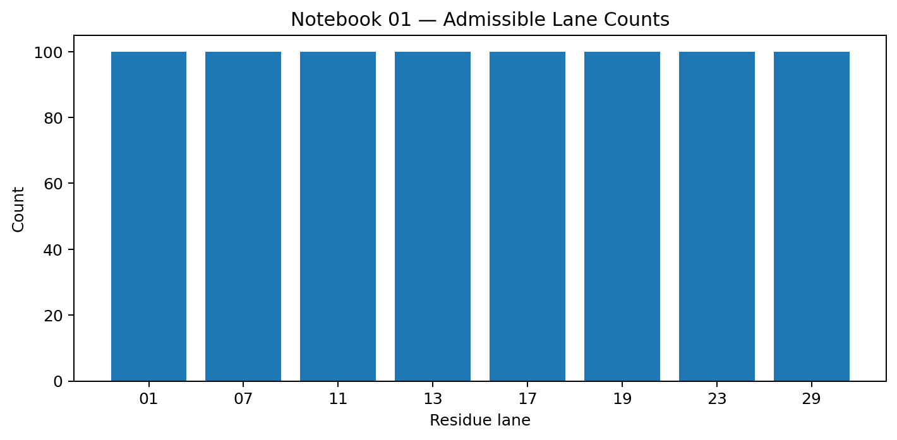

---

# 2. Rolling Residue-Lane Construction

We define rolling residue occupancy vectors:

\[
x_t \in \mathbb{R}^8
\]

where each coordinate represents rolling occupancy counts for one admissible residue lane.

Rolling windows generate temporal manifold trajectories across the eight-lane system.

Primary measurements include:

- rolling occupancy counts,
- cosine similarity,
- Euclidean drift,
- local lane leadership,
- and trajectory imbalance.

---

## Figure 2 — Rolling Prime Lane Trajectories

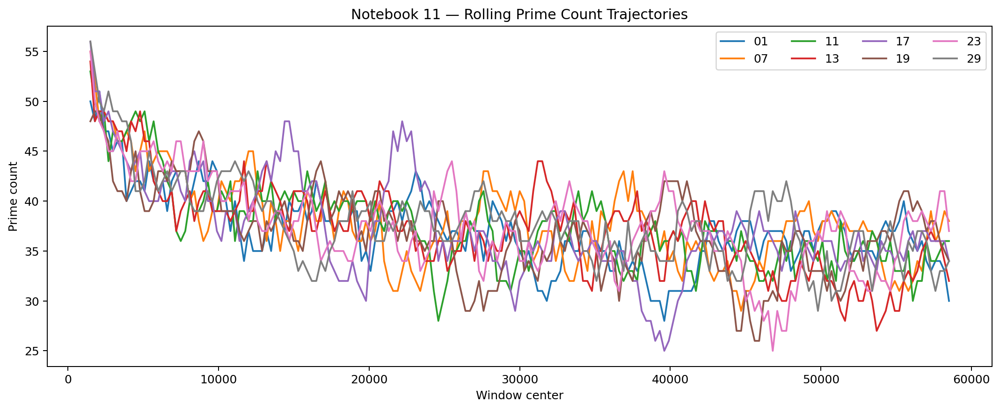

---

## Figure 3 — Rolling Prime Lane Vectors

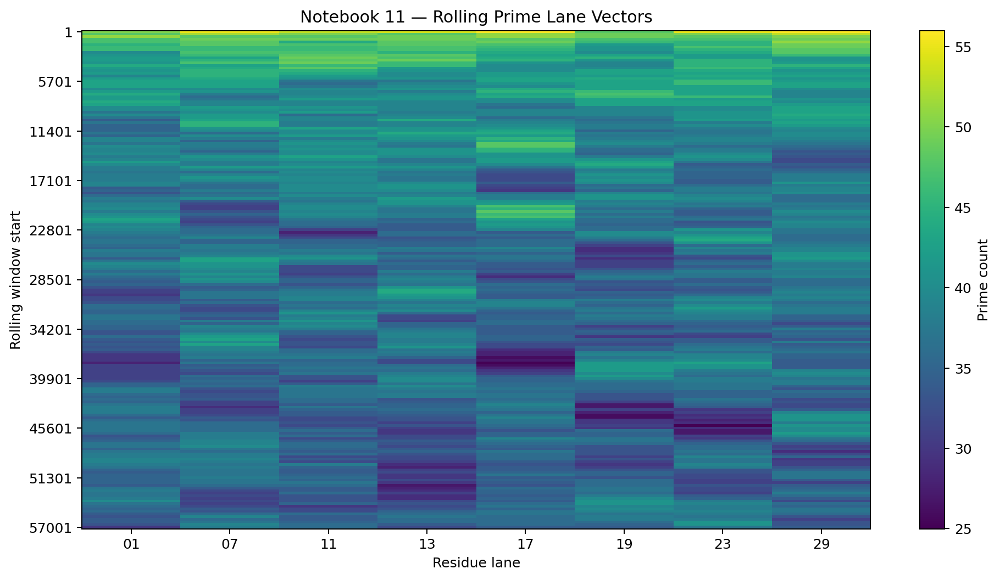

---

# 3. Boundary and Reflection Dynamics

The central modulo-30 boundary separates:

\[
11 \rightarrow 13 \mid 17 \rightarrow 19
\]

This boundary produces reflected-pair dynamics between lanes 13 and 17.

We define:

- reflection gaps,
- boundary imbalance,
- reflection pressure,
- and local leadership windows.

These measurements transform rolling occupancy trajectories into measurable dynamical state variables.

---

## Figure 4 — Lane 13 vs Lane 17

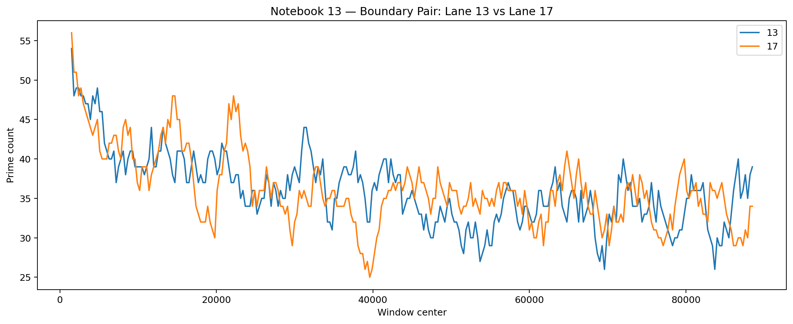

---

## Figure 5 — Reflection Gap Dynamics

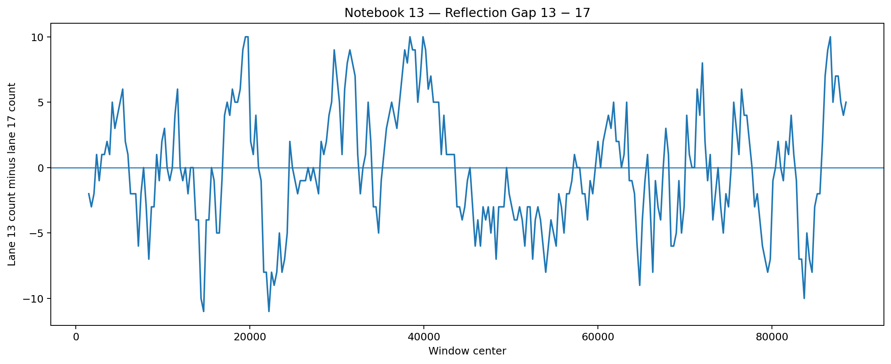

---

## Figure 6 — Boundary Reflection Pressure

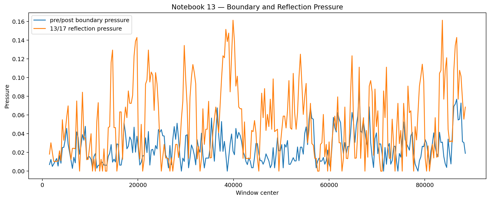

---

# 4. Spectral Dynamics

Rolling occupancy trajectories generate covariance structure across admissible residue lanes.

We analyze:

- covariance matrices,
- eigenspace decomposition,
- explained variance,
- spectral entropy,
- and temporal eigenspace drift.

The rolling residue manifold exhibits coherent low-rank structure across rolling windows.

---

## Figure 7 — Explained Variance

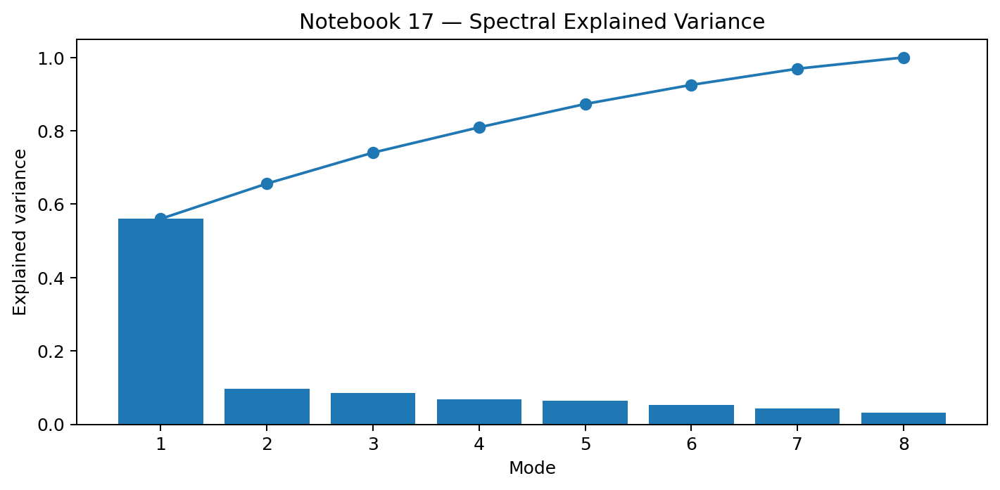

---

## Figure 8 — Eigenspace Dynamics

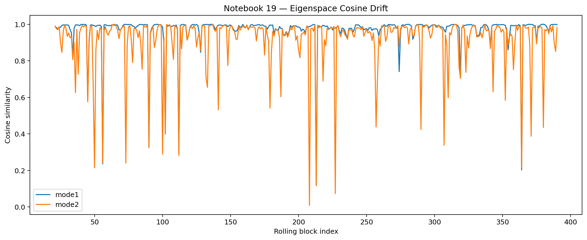

---

## Figure 9 — Spectral Entropy

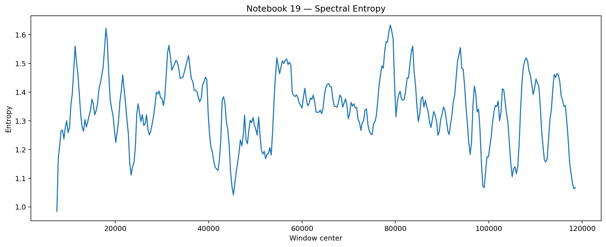

---

# 5. Graph Manifold Structure

Residue-lane trajectories define weighted graph relationships between admissible residue classes.

We construct:

- lane similarity graphs,
- adjacency matrices,
- graph Laplacians,
- graph embeddings,
- and graph signal modes.

This converts the rolling residue manifold into a learned graph-topological system.

---

## Figure 10 — Residue Lane Similarity Graph

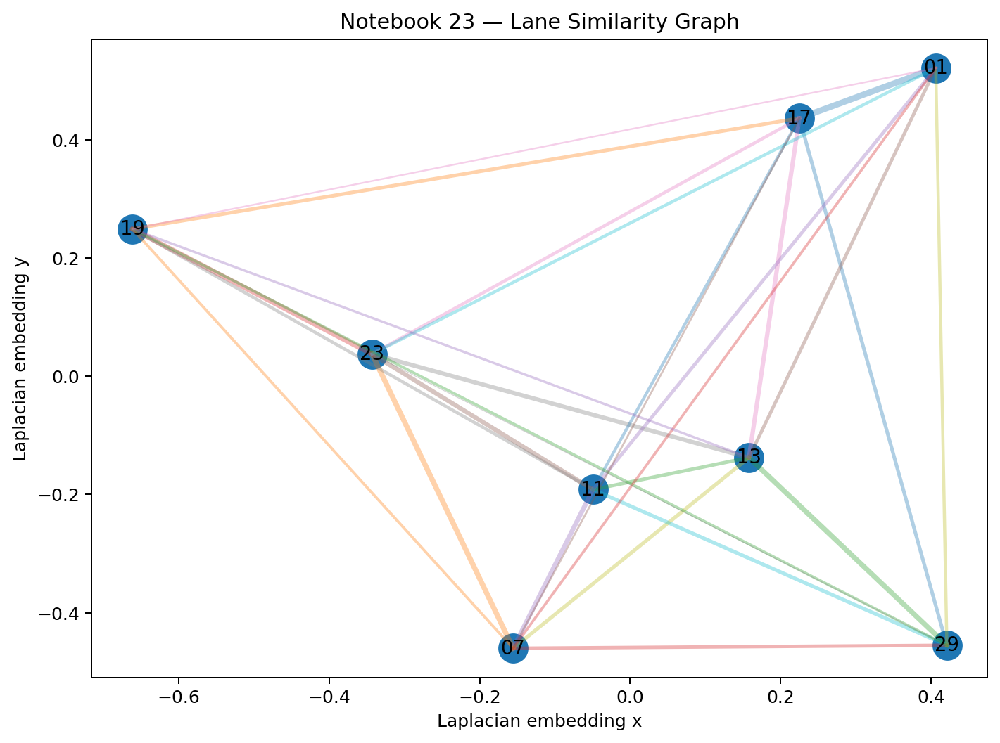

---

## Figure 11 — Laplacian Embedding

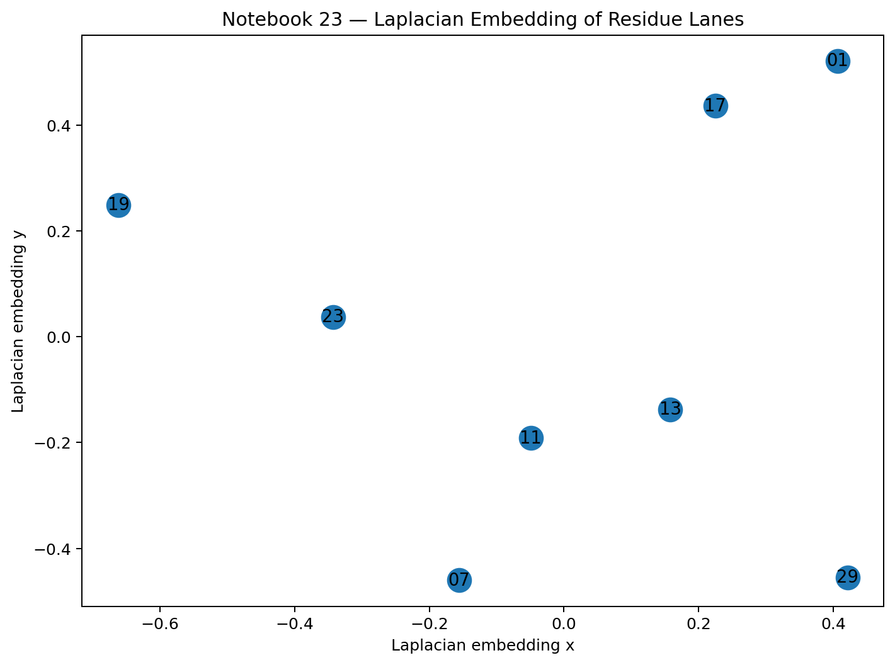

---

## Figure 12 — Graph Signal Mode Scores

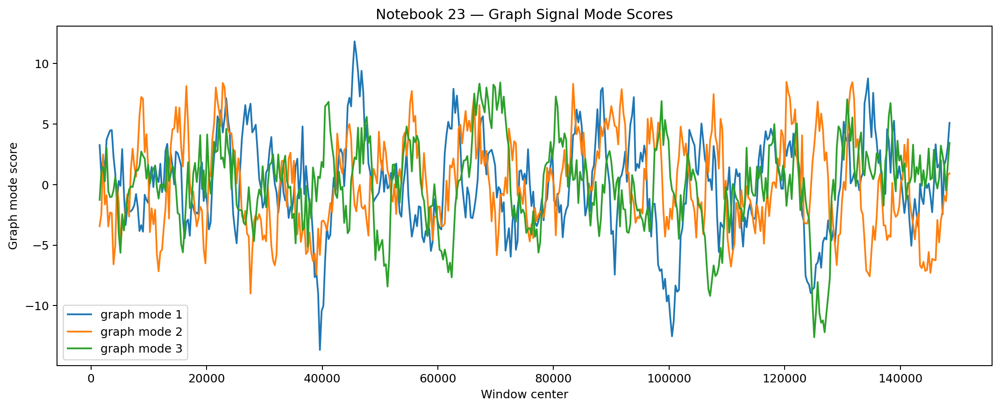

---

# 6. Sparse Reset-Boundary Emergence

Sparse transition behavior concentrates near the modulo-reset boundary:

\[
23 \rightarrow 29 \rightarrow 01
\]

We define:

- sparse events,
- reset pressure,
- boundary imbalance,
- and sparse transition manifolds.

These sparse structures emerge nonuniformly across rolling windows and organize near reset-boundary transitions.

---

## Figure 13 — Sparse Event Timeline

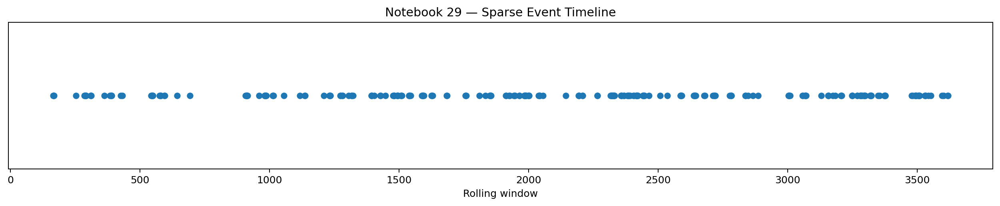

---

## Figure 14 — Sparse Feature Heatmap

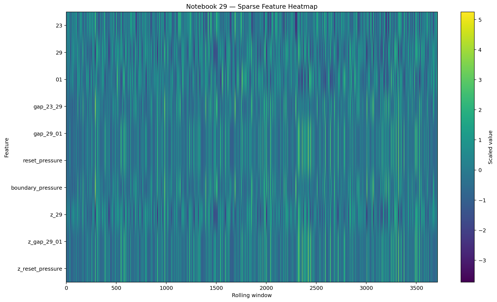

---

## Figure 15 — Reset Boundary Graph

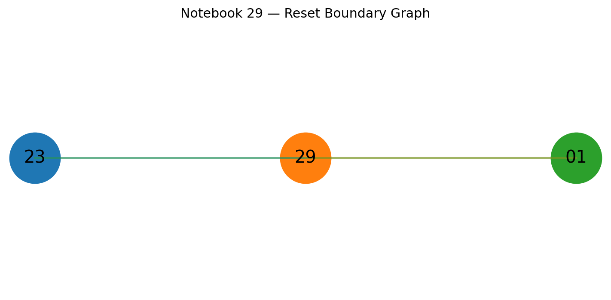

---

# 7. Discussion

The admissible residue lanes of modulo 30 exhibit coherent rolling dynamical organization across multiple scales:

- trajectory dynamics,
- boundary pressure,
- spectral decomposition,
- graph embeddings,
- and sparse transition emergence.

The resulting structure connects:

- computational experimental mathematics,
- rolling manifold analysis,
- graph signal processing,
- spectral dynamical systems,
- and sparse-event trajectory analysis.

The residue manifold behaves neither as a static wheel nor as random occupancy noise. Instead, the rolling system exhibits bounded temporal organization across spectral, graph, and sparse dynamical domains.

---

# 8. Conclusion

The eight admissible residue lanes of modulo 30 form a coherent rolling manifold over:

\[
\mathbb{Z}/30\mathbb{Z}
\]

This rolling manifold exhibits:

- bounded drift,
- reflected boundary dynamics,
- coherent low-rank spectral structure,
- graph-topological organization,
- and sparse reset-boundary emergence.

These results suggest that admissible residue trajectories support a broader computational experimental mathematics framework for rolling manifold analysis over modular arithmetic systems.

---

# Repository

https://github.com/thinkthoughts/mod30-residue-lanes

---

# Lab Report

https://labreports.app/mod30/
